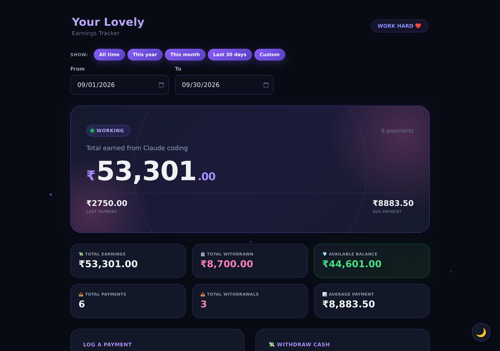
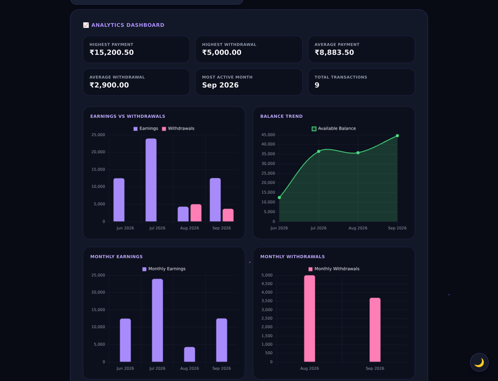
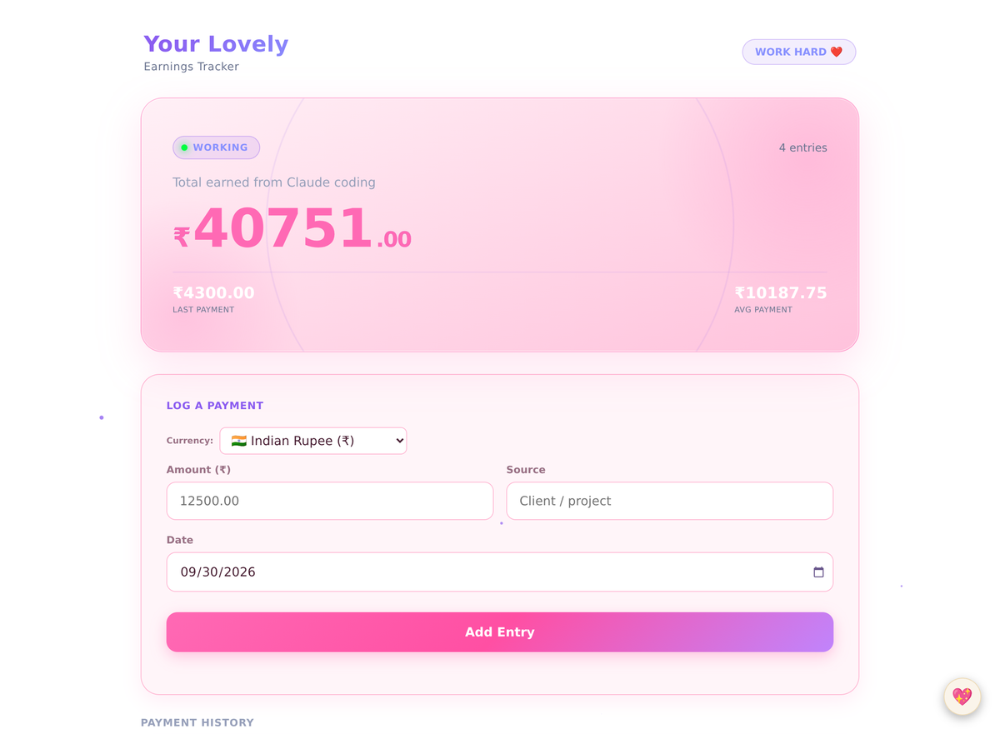
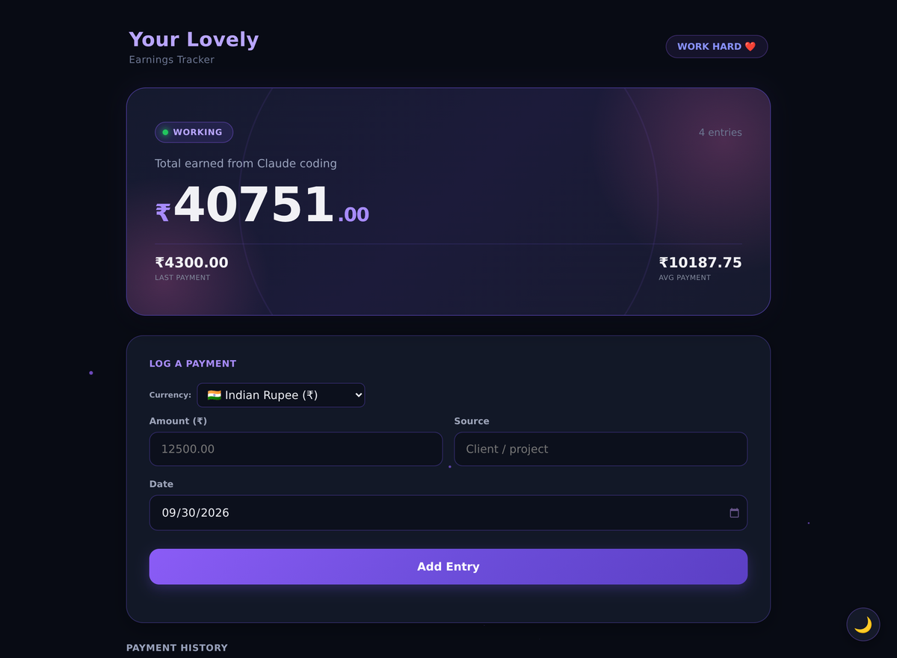
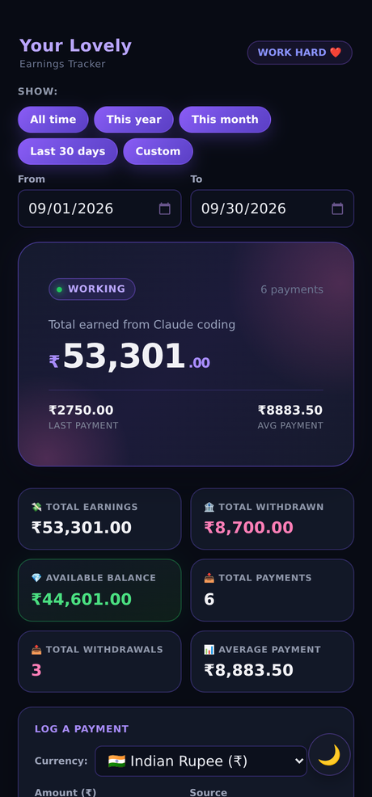
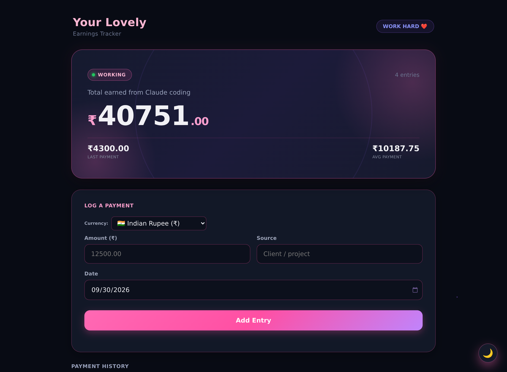

# 💸 Earnings Tracker

**Three self-contained earnings dashboards that run straight from a file — no build step, no backend, no accounts.**
Log what you earn, log what you withdraw, and watch the balance, analytics and charts update instantly. Everything is stored locally in your browser.

[](LICENSE)
[](https://developer.mozilla.org/docs/Web/JavaScript)
[](#-checks--ci)
[](#-your-data-is-yours)
[](https://github.com/bababoi6769/Earnings-tracker-/pulls)



---

## 🚀 Quick start

Nothing to install. Pick one:

```bash
# 1. Just open it — double-click any app file, e.g.
open apps/ultimate/index.html          # macOS
start apps/ultimate/index.html         # Windows
xdg-open apps/ultimate/index.html      # Linux

# 2. Or serve the folder if you prefer a real URL
python3 -m http.server 8000
# → http://localhost:8000/apps/ultimate/
```

Every app is a single HTML file. Copy it anywhere — a USB stick, a phone, a shared drive — and it keeps working.

## 🗂 The three editions

| Edition | File | Best for |
| --- | --- | --- |
| **Ultimate** ⭐ | [`apps/ultimate/index.html`](apps/ultimate/index.html) | The full dashboard: earnings **and** withdrawals, available balance, analytics, 5 charts, date filters |
| **Girly Pop** 💖 | [`apps/girlypop/index.html`](apps/girlypop/index.html) | The classic tracker with a playful pink light theme and a matching dark theme |
| **Dark Edition** 🌙 | [`apps/dark/index.html`](apps/dark/index.html) | The same classic tracker, tuned for a compact dark or light look |

All three can live side by side — they share nothing, and each keeps its own data under its own storage keys.

## 🖼 Screenshots

| Ultimate — analytics | Girly Pop — light | Dark Edition |
| --- | --- | --- |
|  |  |  |

| Mobile — Ultimate | Girly Pop — dark |
| --- | --- |
|  |  |

## ✨ Features

| | Ultimate | Girly Pop | Dark |
| --- | :---: | :---: | :---: |
| Log payments (amount, source, date) | ✅ | ✅ | ✅ |
| Payment history + delete with confirm | ✅ | ✅ | ✅ |
| Total, last and average payment | ✅ | ✅ | ✅ |
| 8 currencies with live formatting | ✅ | ✅ | ✅ |
| Live currency converter | ✅ | ✅ | ✅ |
| Cash withdrawals + balance tracking | ✅ | — | — |
| Analytics: highest, averages, most active month | ✅ | — | — |
| Charts: earnings vs withdrawals, balance trend, monthly, sources | ✅ | — | — |
| Date filters (all / year / month / last 30 days / custom) | ✅ | — | — |
| Corrupted-data recovery + error screen | ✅ | — | — |
| Keyboard, screen-reader and reduced-motion friendly | ✅ | ✅ | ✅ |
| Works fully offline | ✅ | ✅ | ✅ |

Extra polish that is baked into every edition:

- **Nothing to configure** — open the file and start typing.
- **Enter submits** the form, labels are wired to their inputs, and destructive actions ask first.
- **Animated totals** roll up like a slot machine when you log a payment.
- **`prefers-reduced-motion`** switches all of that off automatically.
- **Chart.js is vendored** into [`apps/ultimate/vendor/`](apps/ultimate/vendor), so the charts never depend on a CDN.

## 🔐 Your data is yours

- Entries live in your browser's `localStorage` under that app's own keys — nothing is uploaded anywhere.
- The only outbound request any app makes is to a **public exchange-rate API** (Frankfurter, with two fallbacks) for the optional currency converter. Turn off your network and everything else still works.
- Clearing your browser's site data removes your entries, so keep a backup of anything important.

## 🛠 Project structure

```
.
├── apps/
│   ├── ultimate/index.html          # earnings + withdrawals + analytics
│   │   └── vendor/chart.umd.min.js  # Chart.js 4.4.1 (MIT), served locally
│   ├── girlypop/index.html          # pink edition
│   └── dark/index.html              # compact dark edition
├── docs/screenshots/                # images used by this README
├── scripts/validate.mjs             # dependency-free checks
└── .github/workflows/validate.yml   # runs those checks on every push
```

Each app file contains its own markup, styles and logic — deliberately, so that a single file stays a complete, portable product.

## ✅ Checks & CI

```bash
node scripts/validate.mjs
```

The script (and the GitHub Actions workflow that runs it on every push and pull request) verifies that, for each app:

1. required files exist, including vendored assets,
2. inline CSS braces are balanced,
3. inline JavaScript parses — a typo can never ship a blank page,
4. no `console.log()` debug statements are left behind,
5. element ids are unique,
6. there are no remote script dependencies (the offline promise),
7. every local asset reference and README link resolves.

## 🧭 Roadmap

- [ ] CSV / JSON export and import
- [ ] Recurring payments (weekly, monthly)
- [ ] An installable PWA shell with offline caching
- [ ] Optional custom categories and tags

Ideas and pull requests are welcome — open an issue and describe the workflow you want.

## 🤝 Contributing

1. Fork the repository and branch off `main`.
2. Keep each edition a single self-contained HTML file; share nothing between them.
3. Run `node scripts/validate.mjs` before opening a pull request — CI runs the same checks.
4. Match the existing style: 2-space indent, `const`/`let`, no frameworks, no build step.

## 📄 License

Released under the [MIT License](LICENSE). Chart.js is bundled under its own MIT license.

---

<p align="center">Built and maintained by <a href="https://github.com/bababoi6769">@bababoi6769</a> · Earn it, log it, watch it grow 📈</p>
